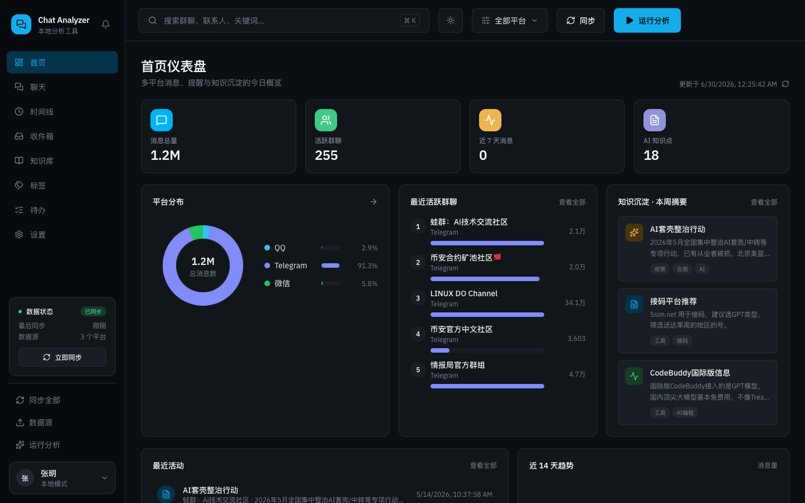
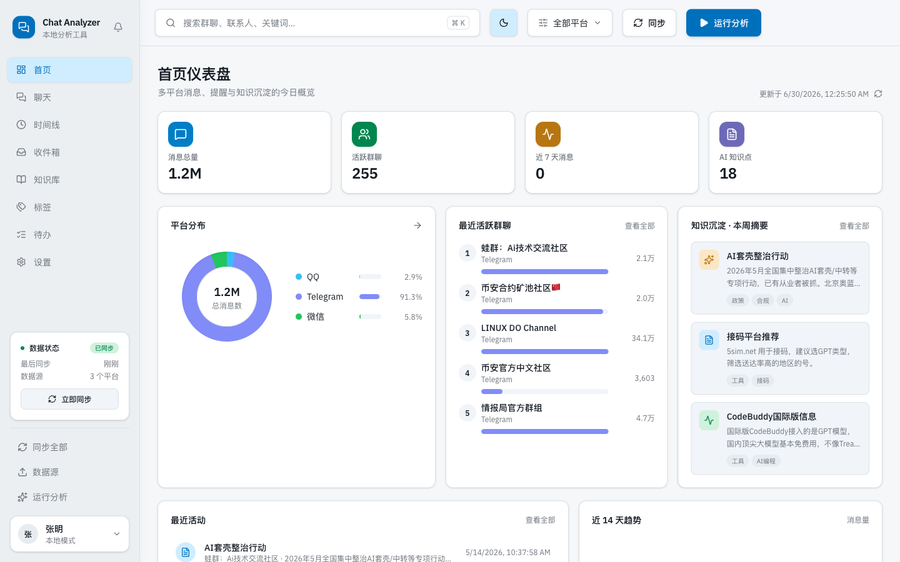
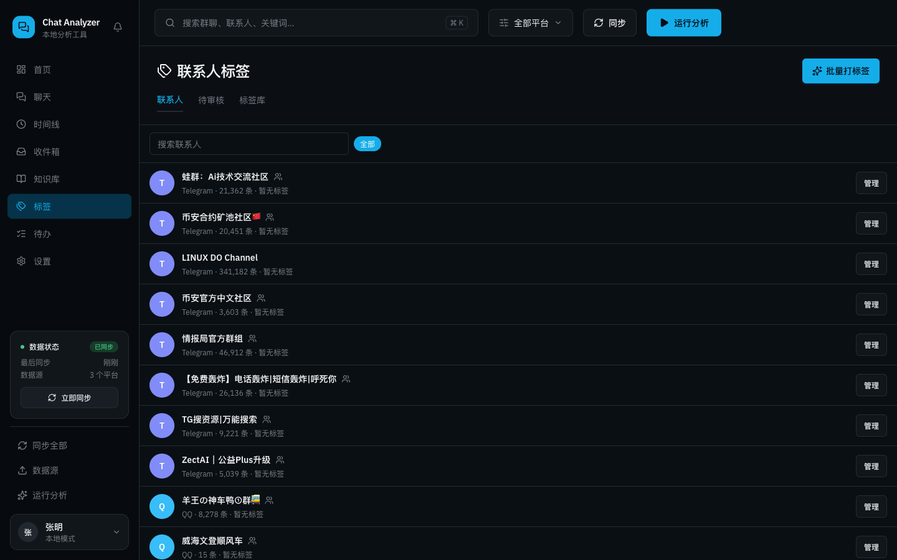
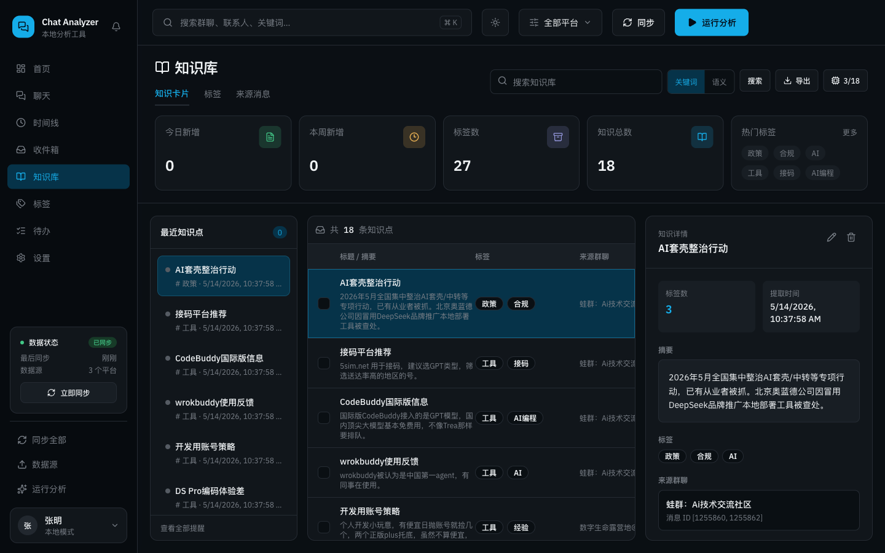

# Chat Analyzer · 聊天记录智能分析系统

> 本地优先的多平台（微信 / QQ / Telegram）聊天记录聚合 + AI 分析工具。所有数据落在本地，AI 只做建议、用户做决策。

A local-first tool that aggregates your WeChat / QQ / Telegram chat history into one SQLite database and uses an LLM to extract knowledge, tag contacts, and surface to-dos — entirely on your machine.



---

## ✨ 功能特性

- **多平台聚合** —— 微信（wx-cli）、QQ（NapCat + QCE）、Telegram（Telethon 账号 API）的消息统一进一个 SQLite，平台只是字段不是孤岛。
- **LLM 分析流水线** —— 预过滤去噪 → 30 分钟时间窗切分 → 逐窗分类（important / todo / casual + 紧急度）→ 整体摘要。结果先入审核表，用户勾选确认才入库。
- **知识库** —— 从聊天中提取的知识点，支持关键词 / 语义搜索（Embedding）、关联推荐、AI 扩展、编辑、导出 Markdown。
- **联系人标签** —— AI 读取聊天记录自动给好友打标签（单个 / 批量 / 定时），预设标签库 + AI 自由补充结合；待审核池、群体洞察、一键加入去噪白名单。跨平台、纯应用内、不写回微信。
- **待办看板** —— 聚合分析产出的待办与行动项，按紧急度排序、可勾选完成。
- **关键词触发器 + 收件箱** —— 命中关键词的消息进收件箱，配 macOS 通知。
- **定时任务** —— 同步（微信 / QQ / Telegram）、自动分析、自动打标签五个独立调度任务。
- **Cool Slate 设计系统** —— 冷峻终端风的深色为主界面，深 / 浅双主题一键切换，ID / 时间戳 / 数值用等宽字体，图表同色相阶梯。
- **安全与用量** —— 配置文件 `0600` 权限、敏感字段脱敏返回；每日 Token 预算与用量追踪；SQLite 自动备份。

## 🖼 界面预览

| 仪表盘（深色） | 仪表盘（浅色） |
|---|---|
|  |  |

| 联系人标签 | 知识库 |
|---|---|
|  |  |

## 🧱 技术栈

| 层 | 技术 |
|---|---|
| 后端 | Python 3.12 · FastAPI · Uvicorn · aiosqlite · httpx |
| 前端 | React 18 · TypeScript · Vite · Tailwind CSS v4 · shadcn 风格组件 · Recharts |
| LLM | Claude CLI（`claude -p`）/ Codex CLI / OpenAI 兼容 API（LM Studio · Ollama）|
| 数据库 | SQLite（`~/.chat-analyzer/data/chat.db`）|
| 微信 | wx-cli ｜ QQ | NapCat + qq-chat-exporter ｜ Telegram | Telethon |

## 🚀 快速开始

前置：Python 3.12、Node 18+，以及至少一个可用的 LLM 后端（Claude CLI 已认证，或本地 LM Studio / Ollama）。

```bash
# 1. 后端
cd backend
python -m venv .venv && source .venv/bin/activate
pip install -e .
python -m uvicorn app.main:app --host 0.0.0.0 --port 8000

# 2. 前端（开发模式，热更新）
cd frontend
npm install
npm run dev          # http://localhost:5173

# 或：构建后由后端单端口 serve
npm run build        # 然后访问 http://localhost:8000
```

数据源接入（微信 / QQ / Telegram）与 LLM 选择，在 **设置 → 数据源 / AI 模型** 页内完成，详见 [`chat-analyzer-项目说明.md`](chat-analyzer-项目说明.md)。

## 🗂 数据存储

| 内容 | 路径 |
|---|---|
| 数据库 | `~/.chat-analyzer/data/chat.db` |
| 配置（`0600` 权限） | `~/.chat-analyzer/config.json` |

> 配置文件含 API Key / QQ token / Telegram session，**保存在仓库之外的用户主目录**，不会进入 git。

## 🔒 隐私

完全本地运行：消息、配置、分析结果都不离开你的机器；LLM 可选用本地模型（LM Studio / Ollama）做到全程离线。AI 产出一律先经用户审核才入库。

## 📄 文档

- [`chat-analyzer-项目说明.md`](chat-analyzer-项目说明.md) —— 架构、数据流、完整 API 端点、配置步骤
- [`PROJECT.md`](PROJECT.md) —— 早期版本说明

## License

[MIT](LICENSE)
